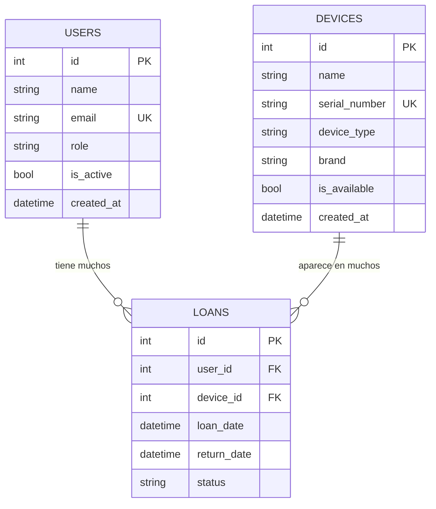
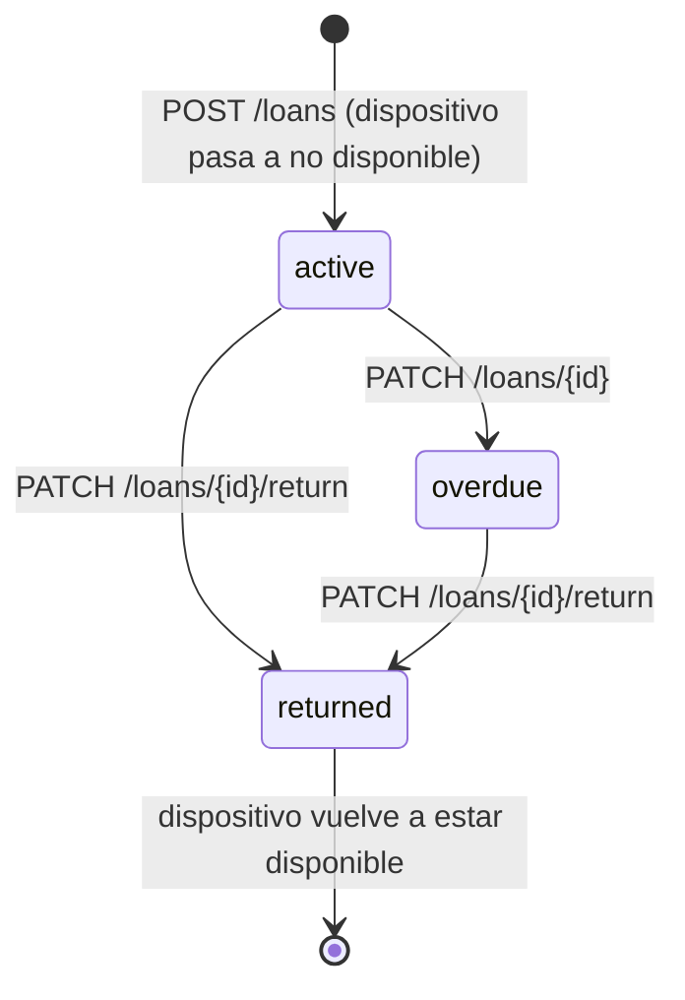
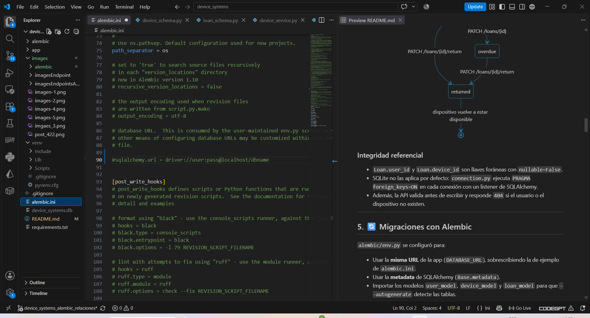
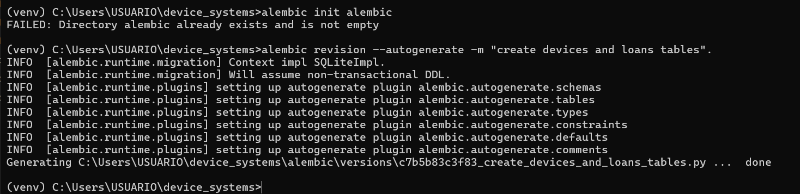
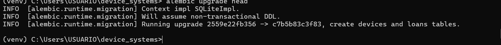
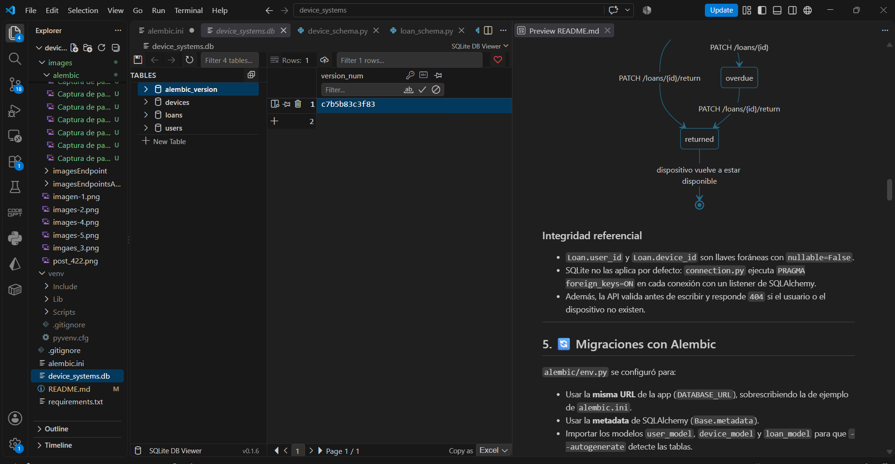

# 🖥️ device_systems

API REST para la gestión de **usuarios, dispositivos tecnológicos y préstamos**, desarrollada con **FastAPI**, **SQLAlchemy** y **Alembic**.


> **Actividad GA1-220501096-01-AA1-EV10** · FastAPI avanzado: migraciones con Alembic, asociaciones de modelos y consultas con joins.
> **Aprendiz:** Brandon Maldonado Mey · SENA · Tecnólogo en Análisis y Desarrollo de Software · Ficha JU6901

---

## 📑 Índice

1. [Descripción general](#1--descripción-general)
2. [Tecnologías](#2--tecnologías)
3. [Estructura del proyecto](#3--estructura-del-proyecto)
4. [Modelo de datos y asociaciones](#4--modelo-de-datos-y-asociaciones)
5. [Migraciones con Alembic](#5--migraciones-con-alembic)
6. [Instalación y ejecución](#6--instalación-y-ejecución)
7. [Endpoints](#7--endpoints)
8. [Consultas con joins y filtros](#8--consultas-con-joins-y-filtros)
9. [Manejo de errores y reglas de negocio](#9--manejo-de-errores-y-reglas-de-negocio)
10. [Pruebas funcionales (16 escenarios)](#10--pruebas-funcionales-16-escenarios)
11. [Evidencias de la actividad anterior](#11--evidencias-de-la-actividad-anterior)
12. [Reflexión final](#12--reflexión-final)
13. [Ramas y entrega](#13--ramas-y-entrega)

---

## 1. 📋 Descripción general

`device_systems` evolucionó de un CRUD de una sola tabla (`users`) a un sistema **relacional** con tres recursos:

| Recurso | Qué permite |
|---|---|
| `/users` | CRUD de usuarios y su historial de préstamos |
| `/devices` | CRUD de dispositivos, filtros e historial de préstamos de cada equipo |
| `/loans` | Registrar préstamos, devolverlos y consultarlos con joins y filtros avanzados |

**Lo nuevo en esta versión**

- ✅ **Migraciones versionadas** con Alembic (`upgrade` y `downgrade`).
- ✅ **Asociaciones One-to-Many / Many-to-One** entre `User`, `Device` y `Loan`.
- ✅ **Integridad referencial** con llaves foráneas activas en SQLite.
- ✅ **Consultas con `join()`**, `where()`, `ilike()`, `or_()` y `and_()`.
- ✅ **Reglas de negocio** con respuestas `409 Conflict`.
- ✅ Documentación **Swagger/ReDoc** organizada por tags: *Users*, *Devices* y *Loans*.

---

## 2. 🛠️ Tecnologías

| Tecnología | Uso |
|---|---|
| Python 3.11+ | Lenguaje base |
| FastAPI | Framework de la API |
| Uvicorn | Servidor ASGI |
| SQLAlchemy 2.x | ORM, relaciones y joins |
| Alembic | Migraciones de base de datos |
| SQLite | Base de datos relacional |
| Pydantic v2 | Validación y serialización |
| Swagger UI / ReDoc | Documentación automática |
| Git y GitHub | Control de versiones |

---

## 3. 📁 Estructura del proyecto

```
device_systems/
├── app/
│   ├── main.py
│   ├── database/
│   │   └── connection.py            # engine, SessionLocal, Base, PRAGMA foreign_keys=ON
│   ├── models/
│   │   ├── user_model.py
│   │   ├── device_model.py
│   │   └── loan_model.py
│   ├── schemas/
│   │   ├── user_schema.py
│   │   ├── device_schema.py
│   │   └── loan_schema.py
│   ├── routes/
│   │   ├── user_routes.py
│   │   ├── device_routes.py
│   │   └── loan_routes.py
│   ├── services/
│   │   ├── user_service.py
│   │   ├── device_service.py
│   │   └── loan_service.py
│   └── dependencies/
│       ├── database_dependency.py
│       ├── user_dependencies.py
│       ├── device_dependencies.py
│       └── loan_dependencies.py
├── alembic/
│   ├── env.py                        # conectado a la URL y a la metadata de la app
│   └── versions/
│       └── 2559e22fb356_create_users_devices_and_loans_tables.py
├── alembic.ini
├── requirements.txt
└── README.md
```

| Capa | Responsabilidad |
|---|---|
| **database** | Conexión, sesiones y `Base`. Activa las llaves foráneas de SQLite. |
| **models** | Tablas reales, constraints y relaciones (`ForeignKey`, `relationship`). |
| **schemas** | Contratos de entrada/salida en Pydantic, con ejemplos para Swagger. |
| **services** | Lógica de negocio, joins, filtros y reglas de disponibilidad. |
| **routes** | Endpoints, documentación y códigos de respuesta. |
| **dependencies** | Funciones reutilizables con `Depends()` (sesión, `get_*_or_404`). |

---

## 4. 🗃️ Modelo de datos y asociaciones

### Diagrama entidad-relación



### Tablas

| Tabla | Campos clave |
|---|---|
| `users` | `id`, `name`, `email` (único), `role`, `is_active`, `created_at` |
| `devices` | `id`, `name`, `serial_number` (único), `device_type`, `brand` (opcional), `is_available` (default `True`), `created_at` |
| `loans` | `id`, `user_id` → `users.id`, `device_id` → `devices.id`, `loan_date`, `return_date` (opcional), `status` |

- **Tipos de dispositivo:** `laptop`, `tablet`, `proyector`, `camara`, `router`, `monitor`.
- **Estados de préstamo:** `active`, `returned`, `overdue`.

### Asociaciones

```python
# User
loans = relationship("Loan", back_populates="user", cascade="all, delete-orphan")

# Device
loans = relationship("Loan", back_populates="device", cascade="all, delete-orphan")

# Loan
user = relationship("User", back_populates="loans")
device = relationship("Device", back_populates="loans")
```

- Un **usuario** puede tener muchos préstamos.
- Un **dispositivo** puede aparecer en muchos préstamos históricos.
- Cada **préstamo** pertenece a un usuario y a un dispositivo.

### Ciclo de vida de un préstamo



### Integridad referencial

- `Loan.user_id` y `Loan.device_id` son llaves foráneas con `nullable=False`.
- SQLite no las aplica por defecto: `connection.py` ejecuta `PRAGMA foreign_keys=ON` en cada conexión con un listener de SQLAlchemy.
- Además, la API valida antes de escribir y responde `404` si el usuario o el dispositivo no existen.

---

## 5. 🔄 Migraciones con Alembic

`alembic/env.py` se configuró para:

- Usar la **misma URL** de la app (`DATABASE_URL`), sobrescribiendo la de ejemplo de `alembic.ini`.
- Usar la **metadata** de SQLAlchemy (`Base.metadata`).
- Importar los modelos `user_model`, `device_model` y `loan_model` para que `--autogenerate` detecte las tablas.

> `main.py` ya **no** usa `create_all()`: la estructura de la base de datos la controla Alembic.

### Comandos

```bash
pip install alembic
alembic init alembic
alembic revision --autogenerate -m "create devices and loans tables"
alembic upgrade head
alembic history
```

### Evidencia

<details>
<summary><b>1️⃣ alembic init</b></summary>



</details>

<details>
<summary><b>2️⃣ alembic revision --autogenerate</b></summary>



</details>

<details>
<summary><b>3️⃣ alembic upgrade head</b></summary>



</details>

<details>
<summary><b>4️⃣ Estructura de las tablas generadas</b></summary>



</details>

La migración `2559e22fb356` crea `users`, `devices` y `loans` con sus índices y llaves foráneas, e incluye `downgrade()` para revertirla.

### Si falla una migración

| Situación | Qué hacer |
|---|---|
| Saber en qué versión está la base | `alembic current` |
| Revertir la última migración | `alembic downgrade -1` |
| Volver a aplicar tras corregir | `alembic upgrade head` |
| Error `table ... already exists` | La base ya tenía tablas antes de Alembic: eliminar `device_systems.db` y migrar de nuevo, o usar `alembic stamp head` |

---

## 6. ⚙️ Instalación y ejecución

```bash
# 1. Clonar el repositorio
git clone https://github.com/brandonmesamm-png/device_systems.git
cd device_systems

# 2. Crear y activar el entorno virtual
python -m venv venv
venv\Scripts\activate          # Windows
# source venv/bin/activate     # Linux / Mac

# 3. Instalar dependencias
pip install -r requirements.txt

# 4. Aplicar las migraciones (crea las tablas)
alembic upgrade head

# 5. Ejecutar el servidor
uvicorn app.main:app --reload
```

| Recurso | URL |
|---|---|
| API | http://127.0.0.1:8000 |
| Swagger UI | http://127.0.0.1:8000/docs |
| ReDoc | http://127.0.0.1:8000/redoc |

---

## 7. 📌 Endpoints

> Las rutas están definidas con barra final (por ejemplo `/devices/`). Sin ella, FastAPI redirige automáticamente (307).

### 👤 Users

| Operación | Método | Endpoint | Códigos |
|---|---|---|---|
| Listar / filtrar (`role`, `is_active`) | GET | `/users/` | 200 |
| Consultar por ID | GET | `/users/{user_id}` | 200 · 404 |
| Crear | POST | `/users/` | 201 · 400 |
| Actualizar completo | PUT | `/users/{user_id}` | 200 · 400 · 404 |
| Actualizar parcial | PATCH | `/users/{user_id}` | 200 · 400 · 404 |
| Eliminar | DELETE | `/users/{user_id}` | 204 · 404 · 409 |
| Préstamos de un usuario | GET | `/users/{user_id}/loans` | 200 · 404 |

### 💻 Devices

| Operación | Método | Endpoint | Códigos |
|---|---|---|---|
| Listar / filtrar | GET | `/devices/` | 200 |
| Por tipo | GET | `/devices/?device_type=laptop` | 200 |
| Por disponibilidad | GET | `/devices/?is_available=true` | 200 |
| Por marca | GET | `/devices/?brand=lenovo` | 200 |
| Búsqueda libre | GET | `/devices/?search=thinkpad` | 200 |
| Consultar por ID | GET | `/devices/{device_id}` | 200 · 404 |
| Crear | POST | `/devices/` | 201 · 400 |
| Actualizar completo | PUT | `/devices/{device_id}` | 200 · 400 · 404 |
| Actualizar parcial | PATCH | `/devices/{device_id}` | 200 · 400 · 404 |
| Eliminar | DELETE | `/devices/{device_id}` | 204 · 404 · 409 |
| Historial de préstamos | GET | `/devices/{device_id}/loans` | 200 · 404 |

### 📦 Loans

| Operación | Método | Endpoint | Códigos |
|---|---|---|---|
| Listar / filtrar | GET | `/loans/` | 200 |
| Por estado | GET | `/loans/?status=active` | 200 |
| Por correo del usuario | GET | `/loans/?user_email=aprendiz@sena.edu.co` | 200 |
| Por tipo de dispositivo | GET | `/loans/?device_type=laptop` | 200 |
| Listar con detalle (join) | GET | `/loans/details` | 200 · 400 |
| Consultar por ID (con detalle) | GET | `/loans/{loan_id}` | 200 · 404 |
| Crear préstamo | POST | `/loans/` | 201 · 404 · 409 |
| Devolver préstamo | PATCH | `/loans/{loan_id}/return` | 200 · 404 · 409 |
| Actualizar estado | PATCH | `/loans/{loan_id}` | 200 · 400 · 404 · 409 |

---

## 8. 🔗 Consultas con joins y filtros

`loan_service.py` arma una consulta base con **`join()`** explícito hacia `users` y `devices`, y `joinedload()` para traer usuario y dispositivo en la misma consulta (evita el problema N+1):

```python
select(Loan)
    .join(User, Loan.user_id == User.id)
    .join(Device, Loan.device_id == Device.id)
    .options(joinedload(Loan.user), joinedload(Loan.device))
```

Sobre esa base se acumulan filtros opcionales, todos combinables entre sí:

| Herramienta | Uso |
|---|---|
| `where()` | Estado, usuario, dispositivo y tipo de dispositivo |
| `ilike()` | Búsqueda parcial sin distinguir mayúsculas (correo, marca, nombre) |
| `or_()` | Búsqueda libre en nombre/correo del usuario y nombre/serie del dispositivo |
| `and_()` | Rango de fechas `from_date` / `to_date` |

`GET /loans/details` acepta: `status`, `user_id`, `device_id`, `user_email`, `device_type`, `search`, `from_date`, `to_date`.

**Ejemplo de respuesta de `GET /loans/details`:**

```json
{
  "loan_id": 1,
  "status": "active",
  "loan_date": "2026-09-16T10:30:00",
  "return_date": null,
  "user": {
    "id": 1,
    "name": "Ana Pérez",
    "email": "ana@sena.edu.co"
  },
  "device": {
    "id": 3,
    "name": "Laptop Lenovo ThinkPad",
    "serial_number": "LEN-2024-001",
    "device_type": "laptop"
  }
}
```

---

## 9. ⚠️ Manejo de errores y reglas de negocio

| Caso | Código |
|---|---|
| Registro creado | `201 Created` |
| Consulta o devolución exitosa | `200 OK` |
| Eliminación exitosa | `204 No Content` |
| Usuario, dispositivo o préstamo inexistente | `404 Not Found` |
| Correo o número de serie duplicado | `400 Bad Request` |
| PATCH sin campos · rango de fechas inválido | `400 Bad Request` |
| Dispositivo no disponible | `409 Conflict` |
| Devolver un préstamo ya devuelto | `409 Conflict` |
| Modificar un préstamo ya devuelto | `409 Conflict` |
| Eliminar un usuario con préstamos sin devolver | `409 Conflict` |
| Eliminar un dispositivo con préstamo activo | `409 Conflict` |
| Filtro o cuerpo inválido (enum, tipos) | `422 Unprocessable Entity` |

**`POST /loans`**
1. Valida que el usuario exista.
2. Valida que el dispositivo exista.
3. Valida que el dispositivo esté disponible.
4. Crea el préstamo como `active`.
5. Cambia `is_available` del dispositivo a `False`.

**`PATCH /loans/{id}/return`**
1. Valida que el préstamo exista y no esté devuelto.
2. Lo marca como `returned`.
3. Asigna `return_date`.
4. Cambia `is_available` del dispositivo a `True`.

**`PATCH /loans/{id}`**
1. Valida que el préstamo exista.
2. Si el préstamo ya está `returned`, responde `409 Conflict`.
3. Aplica los cambios de estado permitidos (por ejemplo, marcar `overdue`).

---

## 10. 🧪 Pruebas funcionales (16 escenarios)

| # | Escenario | Evidencia |
|---|---|---|
| 1 | Inicializar Alembic | [`01_alembic_init.png`](images/alembic/01_alembic_init.png) |
| 2 | Generar migración con autogenerate | [`02_alembic_revision.png`](images/alembic/02_alembic_revision.png) |
| 3 | Ejecutar migraciones con Alembic | [`03_alembic_upgrade.png`](images/alembic/03_alembic_upgrade.png) |
| 4 | Verificar tablas generadas en la base de datos | [`05_tablas.png`](images/alembic/05_tablas.png) |
| 5 | Vista general de Swagger UI | [`06_swagger_general.png`](images/alembic/06_swagger_general.png) |
| 6 | Crear usuario | [`07_crear_usuario.png`](images/alembic/07_crear_usuario.png) |
| 7 | Crear dispositivo | [`08_crear_dispositivo.png`](images/alembic/08_crear_dispositivo.png) |
| 8 | Crear préstamo | [`09_crear_prestamo.png`](images/alembic/09_crear_prestamo.png) |
| 9 | Prestar un dispositivo no disponible (409) | [`10_dispositivo_no_disponible.png`](images/alembic/10_dispositivo_no_disponible.png) |
| 10 | Listar préstamos con usuario y dispositivo (join) | [`11_join_details.png`](images/alembic/11_join_details.png) |
| 11 | Filtrar préstamos por estado | [`12_filtro_status.png`](images/alembic/12_filtro_status.png) |
| 12 | Filtrar préstamos por tipo de dispositivo | [`13_filtro_device_type.png`](images/alembic/13_filtro_device_type.png) |
| 13 | Consultar préstamos de un usuario | [`14_prestamos_usuario.png`](images/alembic/14_prestamos_usuario.png) |
| 14 | Devolver un préstamo | [`15_devolucion.png`](images/alembic/15_devolucion.png) |
| 15 | Consultar historial de préstamos del dispositivo | [`17_historial_dispositivo.png`](images/alembic/17_historial_dispositivo.png) |
| 16 | Modificar el estado de un préstamo ya devuelto (409) | [`16_error_patch_prestamo_devuelto.png`](images/alembic/16_error_patch_prestamo_devuelto.png) |

### Swagger UI


### Creación de usuario, dispositivo y préstamo

<details open>
<summary><b>Crear usuario · dispositivo · préstamo (201)</b></summary>


</details>

<details>
<summary><b>Dispositivo no disponible (409)</b></summary>


</details>

### Consultas con joins y filtros

<details open>
<summary><b>Join: préstamos con usuario y dispositivo</b></summary>


</details>

<details>
<summary><b>Filtros: estado · tipo de dispositivo · préstamos de un usuario</b></summary>


</details>

### Devolución y reglas de negocio

<details open>
<summary><b>Devolver un préstamo y consultar historial del dispositivo</b></summary>


</details>

<details>
<summary><b>Error al modificar un préstamo ya devuelto (409)</b></summary>


</details>

---

## 11. 🗂️ Evidencias de la actividad anterior

Se conservan las pruebas del CRUD de `/users` de la versión con SQLAlchemy.

<details>
<summary><b>Swagger UI y ReDoc (versión anterior)</b></summary>


</details>

<details>
<summary><b>Pruebas de endpoints exitosos</b></summary>


</details>

<details>
<summary><b>Pruebas de escenarios de error</b></summary>


</details>

---

## 12. 🧠 Reflexión final

Pasar de un CRUD de una sola tabla a un sistema con usuarios, dispositivos y préstamos cambió la forma en que pienso una API: ya no se trata solo de guardar y devolver registros, sino de **proteger la coherencia entre ellos**. Un préstamo no tiene sentido sin un usuario y un dispositivo reales, y un dispositivo prestado no puede prestarse otra vez. Esas reglas viven en las relaciones del modelo (`ForeignKey`, `relationship`, `back_populates`) y en los servicios.

**Las migraciones** con Alembic fueron el cambio más importante de mentalidad. Antes, `create_all()` creaba las tablas la primera vez y cualquier cambio obligaba a borrar la base de datos. Con Alembic, cada cambio estructural queda como una versión con `upgrade()` y `downgrade()`, se puede aplicar y revertir de forma controlada y queda registrado en el repositorio junto al código. Además, aprendí que la migración solo detecta los modelos que `env.py` importa.

**Las relaciones** me obligaron a pensar en el ciclo completo: al crear un préstamo hay que marcar el dispositivo como no disponible, al devolverlo hay que liberarlo y al borrar un usuario hay que decidir qué pasa con sus préstamos. Probando la API encontré casos que no había previsto, como que eliminar un usuario con un préstamo activo dejaba el dispositivo bloqueado para siempre, o que se podía cambiar el estado de un préstamo ya devuelto. Corregirlos con respuestas `409 Conflict` me mostró que las reglas de negocio también son parte del diseño. También descubrí que SQLite no aplica las llaves foráneas por defecto y que hay que activarlas con `PRAGMA foreign_keys=ON`.

**Las consultas avanzadas** con `join()`, `where()`, `ilike()`, `or_()` y `and_()` permiten responder preguntas reales (¿qué laptops están prestadas y a quién?) en una sola consulta, y `joinedload()` evita una consulta adicional por cada préstamo. Los filtros opcionales se construyen acumulando condiciones sobre una consulta base, y cada endpoint debe declarar de verdad los parámetros que promete: en una revisión detecté que `/loans` ignoraba en silencio `user_email` y `device_type`, y lo corregí.

En conjunto, esta actividad me mostró cómo evoluciona una API real: con cambios de estructura versionados, datos relacionados, reglas de negocio explícitas y una documentación en Swagger que refleja lo que el sistema realmente hace.

---

## 13. 🌱 Ramas y entrega

| Rama | Contenido |
|---|---|
| `main` | Rama principal, versión estable |
| `develop` | Integración de las funcionalidades completas |
| `feature` | Estructura base del proyecto |
| `feature-crud-completo` | CRUD en memoria (actividad anterior) |
| `feature-crud-sqlalchemy` | Persistencia de usuarios con SQLAlchemy + SQLite |
| `device_systems_alembic_relaciones` | **Esta actividad:** Alembic, `Device` y `Loan`, asociaciones, joins y filtros. Se unifica con `main`. |