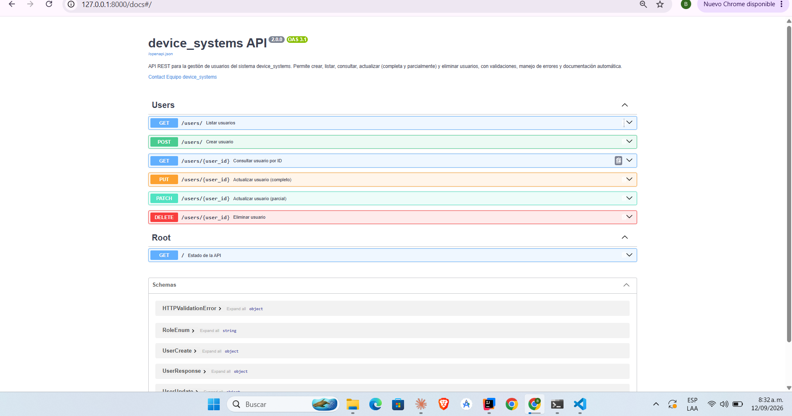
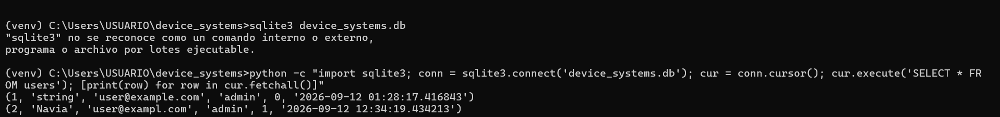

# device_systems

API REST desarrollada con **FastAPI** para la gestión de usuarios del sistema `device_systems`. Este proyecto evoluciona desde una versión con almacenamiento en memoria hacia una API con **persistencia real de datos**, usando **SQLAlchemy** como ORM y **SQLite** como motor de base de datos, manteniendo la actualización completa y parcial, eliminación, manejo estructurado de errores, códigos de estado HTTP correctos, documentación automática con Swagger/OpenAPI y reutilización de lógica mediante Dependency Injection.

---

## 📋 Descripción de la API

`device_systems` expone el recurso `/users`, permitiendo:

- Crear usuarios **en base de datos**.
- Listar usuarios (con filtros opcionales por rol y estado).
- Consultar un usuario por ID.
- Actualizar completamente un usuario (`PUT`).
- Actualizar parcialmente un usuario (`PATCH`).
- Eliminar un usuario (`DELETE`).
- Validar datos de entrada con Pydantic v2.
- Aplicar constraints a nivel de base de datos (`nullable`, `unique`) mediante el modelo SQLAlchemy.
- Manejar errores de forma clara y consistente con `HTTPException`.
- Reutilizar lógica común (búsqueda de usuario, validación de email, sesión de base de datos) mediante `Depends()`.

---

## 🛠️ Tecnologías utilizadas

| Tecnología | Uso |
|---|---|
| Python 3.11+ | Lenguaje base |
| FastAPI | Framework principal de la API |
| Uvicorn | Servidor ASGI |
| SQLAlchemy | ORM para la persistencia de datos |
| SQLite | Motor de base de datos relacional |
| Pydantic v2 | Validación y serialización de datos |
| Swagger UI / ReDoc | Documentación automática |
| Git y GitHub | Control de versiones |
| Postman / Thunder Client | Pruebas funcionales |

---

## 📁 Estructura del proyecto

device_systems/
│── app/
│ │── main.py # Punto de entrada; crea las tablas al arrancar
│ │
│ │── database/
│ │ └── connection.py # engine, SessionLocal, Base
│ │
│ │── models/
│ │ └── user_model.py # Modelo SQLAlchemy (tabla users)
│ │
│ │── routes/
│ │ └── user_routes.py # Definición de endpoints de /users
│ │
│ │── schemas/
│ │ └── user_schema.py # Modelos Pydantic (entrada y salida)
│ │
│ │── services/
│ │ └── user_service.py # Lógica CRUD contra la base de datos
│ │
│ │── dependencies/
│ │ ├── database_dependency.py # get_db(): entrega y cierra la sesión
│ │ └── user_dependencies.py # Funciones reutilizables con Depends()
│
│── device_systems.db # Base de datos SQLite (generada, no versionada)
│── requirements.txt
│── README.md


**Separación de responsabilidades:**

- **database:** configura la conexión (`engine`), la fábrica de sesiones (`SessionLocal`) y la clase base (`Base`) de la que heredan los modelos.
- **models:** representan las tablas reales de la base de datos, con sus tipos de columna y constraints (`nullable=False`, `unique=True`).
- **routes:** definen los endpoints, reciben la petición HTTP y delegan la lógica a `services`, usando `Depends()` para inyectar dependencias (incluida la sesión de base de datos).
- **schemas:** modelos Pydantic para validar entradas (`UserCreate`, `UserUpdate`) y dar forma a las salidas (`UserResponse`). **No deben confundirse con los modelos SQLAlchemy** (ver sección siguiente).
- **services:** contiene la lógica de negocio (crear, buscar, actualizar, eliminar) ejecutando consultas reales contra la base de datos mediante `Session`.
- **dependencies:** funciones reutilizables inyectadas con `Depends()`, como obtener la sesión de base de datos (`get_db`) u obtener un usuario por ID (`get_user_or_404`).

---

## 🧩 Modelo SQLAlchemy vs Schema Pydantic

Un punto clave de esta evolución fue diferenciar dos capas que antes no existían por separado:

| | Modelo SQLAlchemy (`user_model.py`) | Schema Pydantic (`user_schema.py`) |
|---|---|---|
| **Qué representa** | La tabla real `users` en SQLite | La forma del JSON que entra/sale de la API |
| **Para qué sirve** | Definir columnas, tipos SQL y constraints | Validar datos y documentar la API |
| **Dónde se usa** | Dentro de `user_service.py` (`db.query(User)...`) | En los endpoints, como tipo de parámetros y `response_model` |
| **Constraints típicas** | `nullable=False`, `unique=True`, `default=...` | `min_length`, `EmailStr`, `Enum` de valores permitidos |

La tabla `users` tiene las columnas `id, name, email, role, is_active, created_at`; sobre esos mismos datos, la API expone distintos "recortes" según el momento: `UserCreate` (sin id), `UserUpdate` (todo opcional, para PATCH) y `UserResponse` (con id y created_at, para las respuestas).

---

## 🗄️ Persistencia de datos

`app/database/connection.py` configura:

- `DATABASE_URL = "sqlite:///./device_systems.db"`
- `engine`: motor de conexión (`check_same_thread=False`, necesario para SQLite junto a FastAPI).
- `SessionLocal`: fábrica de sesiones, una nueva por cada request.
- `Base`: clase declarativa de la que hereda el modelo `User`.

En `main.py`, `Base.metadata.create_all(bind=engine)` crea automáticamente la tabla `users` en SQLite la primera vez que se ejecuta la aplicación, si no existe todavía.

---

## ⚙️ Instalación y ejecución

### 1. Clonar el repositorio

```bash
git clone <url-del-repositorio>
cd device_systems
```

### 2. Crear y activar entorno virtual

```bash
python -m venv venv

# Windows
venv\Scripts\activate

# Linux / Mac
source venv/bin/activate
```

### 3. Instalar dependencias

```bash
pip install -r requirements.txt
```

### 4. Ejecutar el servidor

```bash
uvicorn app.main:app --reload
```

Al iniciar por primera vez se genera el archivo `device_systems.db` en la raíz del proyecto.

La API quedará disponible en:

- **Base URL:** http://127.0.0.1:8000
- **Swagger UI:** http://127.0.0.1:8000/docs
- **ReDoc:** http://127.0.0.1:8000/redoc

---

## 📌 Tabla de endpoints

| Operación | Método | Endpoint | Código esperado |
|---|---|---|---|
| Listar usuarios | GET | `/users` | 200 OK |
| Filtrar usuarios (rol/estado) | GET | `/users?role=admin&is_active=true` | 200 OK |
| Consultar usuario por ID | GET | `/users/{user_id}` | 200 OK |
| Crear usuario | POST | `/users` | 201 Created |
| Actualizar completo | PUT | `/users/{user_id}` | 200 OK |
| Actualizar parcial | PATCH | `/users/{user_id}` | 200 OK |
| Eliminar usuario | DELETE | `/users/{user_id}` | 204 No Content |
| Usuario no encontrado | GET / PUT / PATCH / DELETE | `/users/{user_id}` | 404 Not Found |
| Correo duplicado | POST / PUT / PATCH | `/users` o `/users/{user_id}` | 400 Bad Request |
| PATCH sin datos | PATCH | `/users/{user_id}` | 400 Bad Request |
| Datos inválidos | Validación Pydantic | Cualquier endpoint con body | 422 Unprocessable Entity |

---

## 📨 Ejemplos de peticiones y respuestas

### POST /users → 201 Created

**Request:**
```json
{
  "name": "Juan Pérez",
  "email": "juan.perez@example.com",
  "role": "admin",
  "is_active": true
}
```

**Response** — nótese que `id` y `created_at` ahora los genera la base de datos, no el cliente:
```json
{
  "id": 1,
  "name": "Juan Pérez",
  "email": "juan.perez@example.com",
  "role": "admin",
  "is_active": true,
  "created_at": "2026-09-12T12:00:00"
}
```

---

### GET /users/{user_id} → 200 OK

**Response:**
```json
{
  "id": 1,
  "name": "Juan Pérez",
  "email": "juan.perez@example.com",
  "role": "admin",
  "is_active": true,
  "created_at": "2026-09-12T12:00:00"
}
```

---

### PUT /users/{user_id} → 200 OK

**Request:**
```json
{
  "name": "Juan Pérez Gómez",
  "email": "juan.perez@example.com",
  "role": "support",
  "is_active": false
}
```

**Response:**
```json
{
  "id": 1,
  "name": "Juan Pérez Gómez",
  "email": "juan.perez@example.com",
  "role": "support",
  "is_active": false,
  "created_at": "2026-09-12T12:00:00"
}
```

---

### PATCH /users/{user_id} → 200 OK

**Request:**
```json
{
  "role": "support"
}
```

**Response:** solo cambia el campo `role`; el resto permanece igual (incluido `created_at`, que nunca se modifica).

---

### DELETE /users/{user_id} → 204 No Content

Sin cuerpo de respuesta. La fila se elimina realmente de la tabla `users` en SQLite (verificable con DB Browser for SQLite).

---

### Errores controlados

**Usuario no encontrado (404):**
```json
{
  "detail": "Usuario no encontrado"
}
```

**Correo duplicado (400):**
```json
{
  "detail": "Ya existe un usuario registrado con el correo juan.perez@example.com."
}
```

**PATCH sin campos (400):**
```json
{
  "detail": "Debe enviar al menos un campo para actualizar."
}
```

**Datos inválidos (422):** generado automáticamente por Pydantic (ejemplo real detectado en pruebas: enviar `"email": "NAVIA.com"` sin `@`):
```json
{
  "detail": [
    {
      "loc": ["body", "email"],
      "msg": "value is not a valid email address: An email address must have an @-sign."
    }
  ]
}
```

---

## 🚦 Códigos de estado HTTP usados

| Código | Significado | Cuándo se usa |
|---|---|---|
| 200 OK | Operación exitosa | GET, PUT, PATCH exitosos |
| 201 Created | Recurso creado | POST exitoso |
| 204 No Content | Eliminación exitosa sin cuerpo | DELETE exitoso |
| 400 Bad Request | Solicitud inválida por reglas de negocio | Correo duplicado, PATCH vacío |
| 404 Not Found | Recurso no encontrado | Usuario inexistente |
| 422 Unprocessable Entity | Error de validación de datos | Body no cumple el esquema Pydantic |

---

## 🔁 Uso de Dependency Injection (`Depends()`)

En `app/dependencies/` se definieron funciones reutilizables que se inyectan en las rutas mediante `Depends()`, evitando duplicar lógica en cada endpoint:

- **`get_db()`** (`database_dependency.py`): entrega una sesión de SQLAlchemy (`Session`) a cada request y garantiza su cierre con `try/finally`, incluso si ocurre un error.
- **`get_user_or_404(user_id, db)`** (`user_dependencies.py`): usa `get_db` internamente para consultar el usuario en la base de datos; si no existe, lanza `HTTPException(status_code=404)`. Se usa en `GET`, `PUT`, `PATCH` y `DELETE` por ID.
- **`get_api_settings()`**: retorna configuración general de la API reutilizable en distintos endpoints.
- **`verify_basic_auth()`**: simula autenticación básica mediante una cabecera `X-API-Key`.

Ejemplo de uso en una ruta, con dependencias anidadas (una dependencia que usa otra):

```python
@router.get("/{user_id}")
def obtener_usuario(usuario: User = Depends(get_user_or_404)):
    return usuario
```

Aquí `get_user_or_404` a su vez depende de `get_db`, y FastAPI resuelve toda la cadena automáticamente.

---

## ⚠️ Manejo de errores implementado

- **Usuario no encontrado** → 404, mensaje `"Usuario no encontrado"`.
- **Correo electrónico duplicado** → 400, verificado con una consulta real a la base de datos (`email_exists`).
- **Actualización parcial sin datos** → 400, mensaje `"Debe enviar al menos un campo para actualizar."`.
- **Eliminación de usuario inexistente** → 404, mismo manejo que la consulta por ID.
- **Datos inválidos** → 422, generado automáticamente por la validación de Pydantic.

Este manejo centralizado evita respuestas genéricas de error 500 y le da al consumidor de la API información clara sobre qué falló y por qué.

### Swagger UI (`/docs`)


### ReDoc (`/redoc`)


### Pruebas de endpoints exitosos


### Pruebas de escenarios de error


### Base de datos generada 


---

## 🧠 Reflexión final

Migrar `device_systems` de una lista en memoria a persistencia real con SQLAlchemy fue un salto conceptual importante: en la versión anterior, cada reinicio del servidor borraba todos los usuarios, algo inaceptable para cualquier sistema real.

Entender la diferencia entre el **modelo SQLAlchemy** (la tabla física, con sus constraints como `nullable` y `unique`) y el **schema Pydantic** (el contrato de entrada/salida de la API) fue el aprendizaje más importante de esta actividad: son capas con responsabilidades distintas, y confundirlas sería un error de diseño.

También fue clave entender el ciclo de vida de una sesión (`db.add()` → `db.commit()` → `db.refresh()`) y por qué `refresh` es necesario para obtener el `id` y `created_at` que la propia base de datos genera. Los errores encontrados en el camino (tabla inexistente por no reiniciar el servidor tras cambiar `main.py`, funciones a las que faltaba pasar `db`, archivos que no quedaban guardados) reforzaron la importancia de leer los tracebacks con calma, identificando la línea exacta del problema, en vez de asumir que todo estaba mal.

En conjunto, este enfoque hace que la API sea más robusta, cercana a un entorno de producción real, y sienta las bases para futuras mejoras como migraciones con Alembic o el cambio a un motor de base de datos como PostgreSQL.

---

## 🌱 Organización de ramas

- **main**: rama principal, reservada para versiones estables.
- **develop**: integración de las funcionalidades completas.
- **feature**: contiene la estructura base del proyecto.
- **feature-crud-completo**: implementación del CRUD en memoria (actividad anterior).
- **feature-crud-sqlalchemy**: migración de la persistencia a SQLAlchemy + SQLite